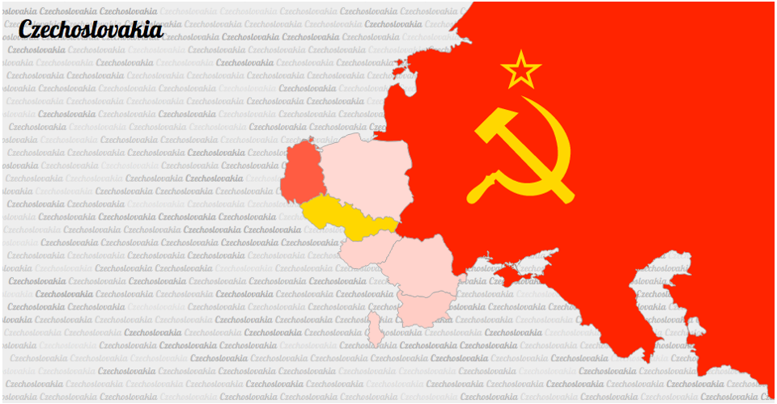

#soviet-block

research and inspiration for this map is compiled at [this readlist](http://readlists.com/481a2657)

an iteration the [GeoJson map of Colombia](http://bl.ocks.org/john-guerra/43c7656821069d00dcbc) from [john-guerra](http://bl.ocks.org/john-guerra)

geography from the [Correlates of War Project](http://correlatesofwar.org/history)

[shapefiles](http://downloads.weidmann.ws/cshapes/Shapefiles/) transmuted to GeoJson by [http://www.mapshaper.org/](http://www.mapshaper.org/)

the keypress easter egg is made possible by the handy [d3.keybinding](http://bl.ocks.org/tmcw/4444952) plugin from the prolific [tmcw](http://bl.ocks.org/tmcw)

